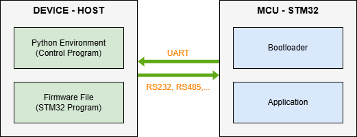

# STM32 Firmware Over-The-Air (FOTA) Update Tool

## Overview
This repository provides a Python-based tool for performing Firmware Over-The-Air (FOTA) updates on STM32 microcontrollers via UART. The tool supports STM32F765VGTx (EXP, single-core) and STM32H745ZIT3 (OBC, dual-core) boards, offering two operational modes: **Option Mode** (interactive menu, default) and **Sequential Mode** (command-line automation).

## Table of Contents
1. [Overview](#overview)
2. [Project Components](#project-components)
3. [Features](#features)
4. [System Architecture](#system-architecture)
   - [Block Diagram](#block-diagram)
   - [Communication Protocol](#communication-protocol)
5. [Usage Instructions](#usage-instructions)
   - [Setup (Prepare)](#1-setup-prepare)
   - [Running in Option Mode](#2-running-in-option-mode)
   - [Running in Sequential Mode](#3-running-in-sequential-mode)
   - [Command Examples](#4-command-examples)
6. [Troubleshooting](#troubleshooting)

## Project Components
1. **[Python Scripts - Host](Bootloader_Host/HOST_DEVICE.md)**: Python script managing FOTA operations.
2. **[STM32 Bootloader](STM32_BOOTLOADER.md)**: Firmware handling communication and updates.
3. **[Application Firmware](FIRMWARE_APPLICATION.md)**: Sample application code for bootloader compatibility.

## Features
- **Supported Boards**: STM32F765VGTx (EXP, single-core), STM32H745ZIT3 (OBC, dual-core).
- **Operational Modes**:
  - **Option Mode**: Interactive menu for manual control (default).
  - **Sequential Mode**: Automated firmware update via command-line.
- **Firmware Management**:
  - SHA256 verification using metadata `.json` files for firmware integrity.
  - CRC32 verification for packet integrity.
  - Metadata storage for SHA256, size, and other details.
  - Timeout mechanism to jump to the application.
- **UART Console**: Interactive terminal for application commands.
- **Error Handling**: Robust validation and error reporting.

## System Architecture

### Block Diagram
<div align="center">
  
</div>

- **Device-Host**: PC or embedded system running Python, managing FOTA and providing `.bin` and `.json` files.
- **MCU-STM32**: STM32 board with bootloader and application.

### Communication Protocol
Packets include:
- **Length**: 1 byte (packet size, excluding length byte).
- **Command**: 1 byte (e.g., `0x10` for Read Chip ID, `0x14` for Write Firmware).
- **Data**: Command-specific data (e.g., firmware, metadata).
- **CRC32**: 4-byte MPEG-2 CRC32 checksum for packet integrity.

## Usage Instructions

### 1. Setup (Prepare)
1. **Flash Bootloader**:
   - Compile using STM32CubeIDE or flash pre-built HEX using STM32 ST-LINK Utility.
2. **Prepare Application Firmware**:
   - Place `.bin` and `.json` (metadata) files in the Python script directory or specify paths.
   - Refer to [FIRMWARE_APPLICATION.md](FIRMWARE_APPLICATION.md) for details.
3. **Install Python Dependencies**:
   ```bash
   pip install -r requirements.txt
   ```
4. **Connect Hardware**:
   - Connect STM32 to the host via UART (115200 baud, 8-N-1).

### 2. Running in Option Mode
Run the script in interactive mode (default):
```bash
python FOTA.py
```
**Menu Options**:
1. **Reset to Bootloader**: Resets the selected board to bootloader mode.
2. **Check Connection**: Verifies bootloader connection.
3. **Read Chip ID**: Reads the MCU chip ID.
4. **Flash Firmware**: Verifies firmware (using SHA256 from `.json`), flashes, and jumps to the application.
5. **Read Firmware Detail**: Reads firmware metadata (SHA256, size, status).
6. **Exit**: Exits the program.

**Notes**:
- Most operations require a successful connection check (option 2) first.
- Option 4 verifies the firmware file using the provided `.json` metadata before flashing and jumps to the application.

### 3. Running in Sequential Mode
Run the script in automated mode:
```bash
python FOTA.py -mode seq -port <PORT> -board <BOARD> [other arguments]
```

**Arguments**:
- `-mode`: Mode selection (`opt` or `seq`, default: `opt`).
- `-port`: Serial port (default: `/dev/ttyAMA3`).
- `-board`: Board type (`EXP` or `OBC`).
- `-bin`: Firmware file for EXP board.
- `-bin1`, `-bin2`: Firmware files for OBC board (Cortex-M7 and Cortex-M4).
- `-meta`: Metadata `.json` file for EXP.
- `-meta1`, `-meta2`: Metadata `.json` files for OBC.

**Sequential Steps**:
- **For EXP**:
  1. Check bootloader connection.
  2. Erase flash memory.
  3. Verify firmware using SHA256 from `.json`.
  4. Flash firmware.
  5. Write metadata.
  6. Jump to application.
- **For OBC**:
  - Repeat steps 2–5 for both cores using `-bin1`, `-bin2`, `-meta1`, `-meta2`.

### 4. Command Examples
1. **Option Mode**:
   ```bash
   python FOTA.py
   ```
   Follow prompts to select port, board, and operations.

2. **Sequential Mode (EXP)**:
   ```bash
   python FOTA.py -mode seq -port /dev/ttyAMA3 -board EXP -bin firmware.bin -meta meta.json
   ```

3. **Sequential Mode (OBC)**:
   ```bash
   python FOTA.py -mode seq -port /dev/ttyAMA3 -board OBC -bin1 firmware1.bin -meta1 meta1.json -bin2 firmware2.bin -meta2 meta2.json
   ```

## Troubleshooting
- **Connection Issues**:
  - Verify COM port and baud rate (115200).
- **Flash Errors**:
  - Check `.bin` and `.json` file integrity and alignment.
  - Ensure erase memory before flashing firmware.
  - Ensure sufficient flash memory for the firmware.
- **Jump to Application Fails**:
  - Verify the application is correctly compiled.
  - Check the application's vector table and reset handler.
  - Ensure metadata `.json` matches the firmware.

For detailed information, refer to the respective README files linked above.