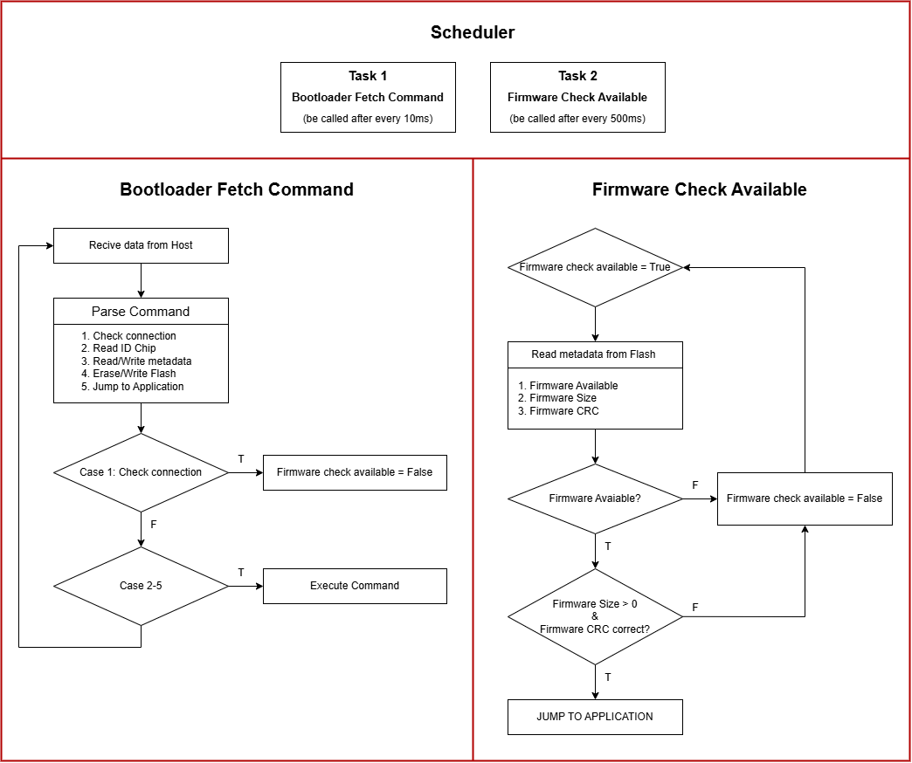

# STM32 Bootloader for FOTA

## Overview
The bootloader is a firmware component running on STM32 microcontrollers (STM32F4, STM32F7, STM32H7) to facilitate **Firmware Over-The-Air (FOTA)** updates via UART. It handles communication with the host device, firmware verification (using SHA256 from metadata `.json` files), and updates.

## Block Diagram
The following diagram illustrates the processing of the Bootloader program:

  

## Features
- **Supported MCUs**: Single-core (STM32F407VGTx, STM32F765VGTx), dual-core (STM32H745ZIT3).
- **UART Communication**: 115200 baudrate, 8-N-1.
- **Commands**:
  - Read Chip ID (`0x10`).
  - Jump to Application (`0x12`).
  - Erase Flash (`0x13`).
  - Write Firmware (`0x14`).
  - Check Connection (`0x15`).
  - Read Firmware Metadata (`0x16`).
  - Write Firmware Metadata (`0x17`).
- **Memory Management**:
  - Dual-bank support for STM32H745ZIT3 (Firmware 1: Bank 1, Firmware 2: Bank 2).
  - Single-bank support for STM32F765VGTx.
  - Metadata storage for firmware SHA256, size, and other details.
- **Firmware Verification**: Uses SHA256 from metadata `.json` files for integrity checks.
- **Timeout Mechanism**: Jumps to the application after 10 seconds (`BL_TIMEOUT`) if no host command is received.

## Memory Map
The bootloader uses a memory layout specific to each MCU type:
- **For STM32F765VGTx (EXP)**:
  - `0x08000000`: Bootloader Firmware (Sector 0, 128 KB).
  - `0x08010000`: Metadata for Firmware (Sector 1, 128 KB).
  - `0x08020000`: Application Firmware (Sectors 2-3, 256 KB).
- **For STM32H745ZIT3 (OBC)**:
  - **Bank 1**:
    - `0x08000000`: Bootloader Firmware (Sector 0, 128 KB).
    - `0x08020000`: Metadata for Firmware 1 (Sector 1, 128 KB).
    - `0x08040000`: Application Firmware 1 (Sectors 2-4, 384 KB).
  - **Bank 2**:
    - `0x08100000`: Bootloader Firmware (Sector 0, 128 KB).
    - `0x08120000`: Metadata for Firmware 2 (Sector 1, 128 KB).
    - `0x08140000`: Application Firmware 2 (Sectors 2-4, 384 KB).

## Implementation Details
- **Command Protocol**:
  - Packets: `[Length (1 byte)] [Command (1 byte)] [Data] [CRC32 (4 bytes)]`.
  - CRC32 verification using hardware CRC peripheral for packet integrity.
  - SHA256 verification using metadata `.json` files for firmware integrity.
- **Flash Operations**:
  - Stores metadata (SHA256, address, length, etc.) in a dedicated sector.
  - Verifies firmware integrity using SHA256 before flashing.
- **Timeout Mechanism**:
  - After 10 seconds (`BL_TIMEOUT = 10000` ticks), checks for valid firmware.
  - Jumps to the application if the firmware is valid. For dual-core systems, both firmwares must be valid.
- **For Dual-Core Support (OBC)**:
  - Cortex-M7 handles bootloader operations and UART communication.
  - Cortex-M4 waits for M7 initialization via HSEM and jumps to its application.

## Notes
- The bootloader assumes a fixed memory layout, which may need adjustment for different STM32 models.
- The application must call `System_On_Bootloader_Reset()` for software reset to bootloader mode.
- Metadata `.json` files contain SHA256 and other firmware details, used for verification.

## Limitations
- Assumes a fixed memory layout, which may need adjustment for different STM32 models.
- No support for secure boot or encrypted firmware.